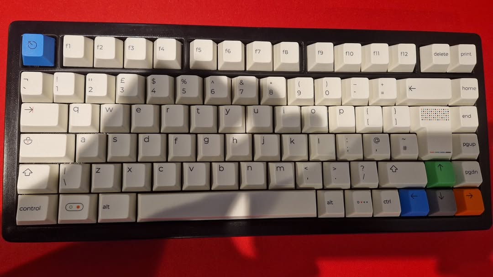
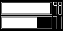
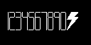
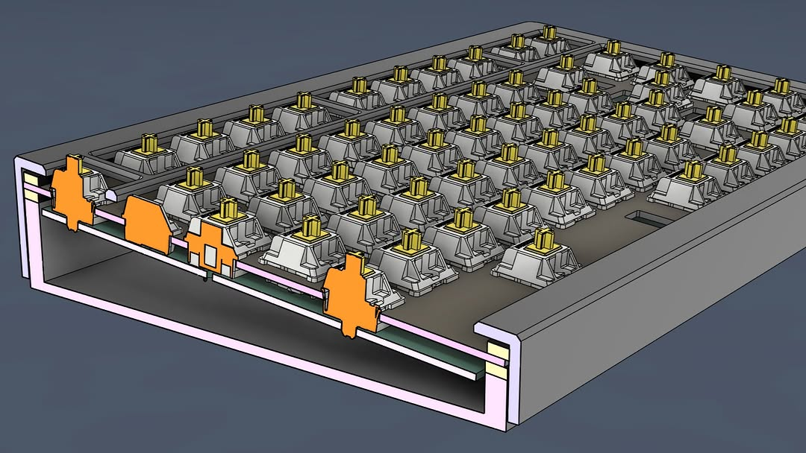
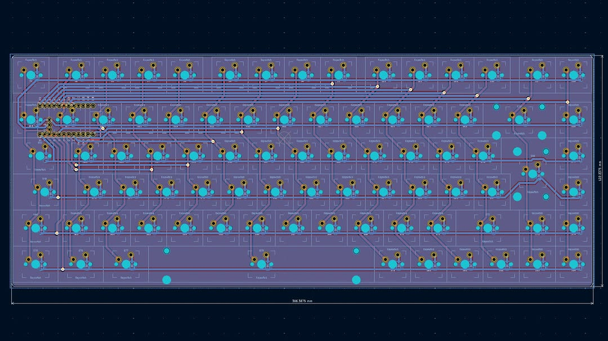
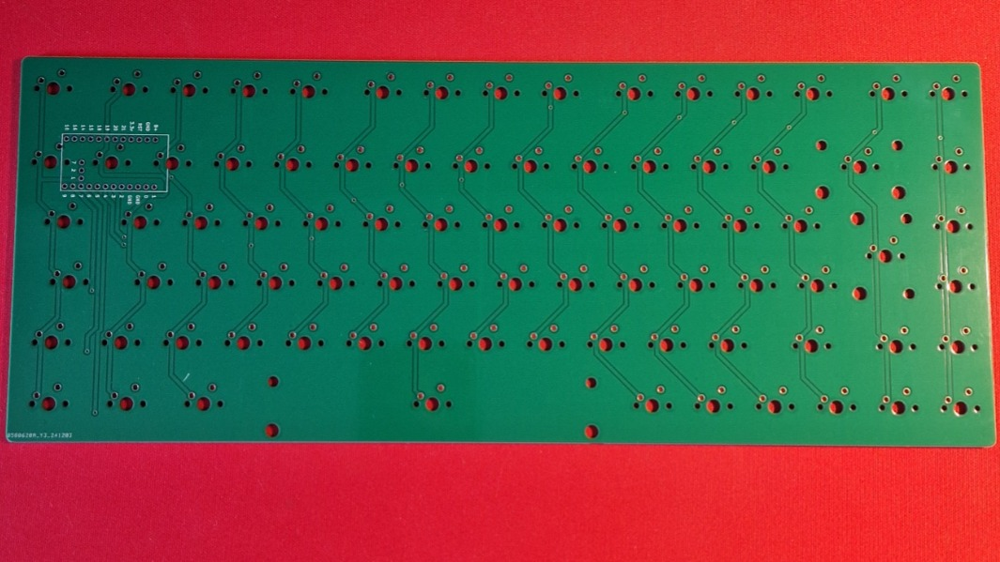
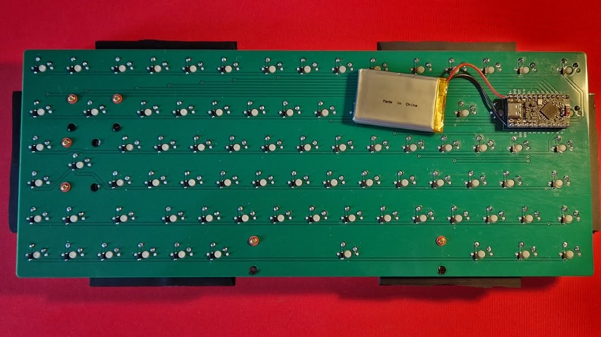
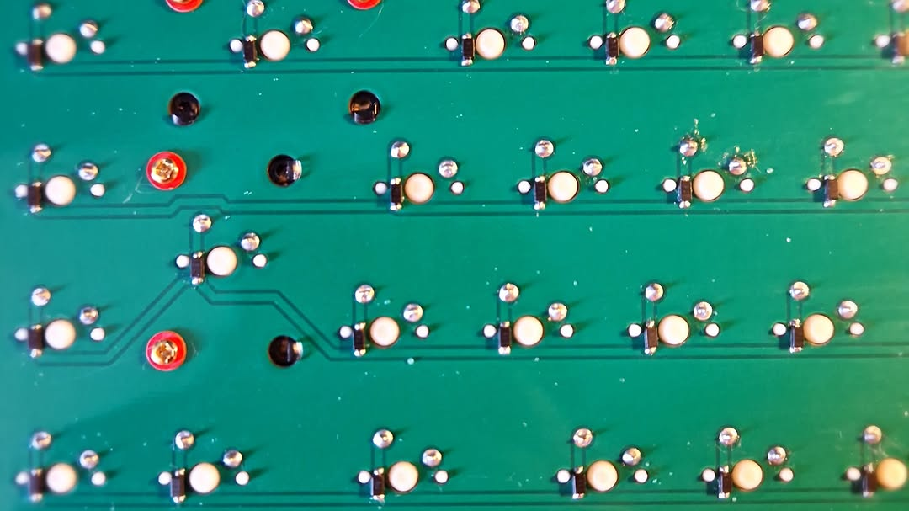

# BHOO Keyboard

[](https://github.com/dhillon-m/custom-keyboard/actions/workflows/build.yml)


[](LICENSE)



A custom wireless keyboard setup with two parts. This repo has the [ZMK](https://zmk.dev) firmware, the KiCad PCB and the case CAD.

| Device      | Role             | Description                                                     |
| ----------- | ---------------- | --------------------------------------------------------------- |
| **BHOO-75** | Split central    | Custom PCB, 75% ISO (UK) with an F-row and arrow cluster. 84 keys. |
| **BHOO-20** | Split peripheral | Handwired numpad with a 128×64 SSD1306 OLED (WIP). 19 keys.      |

Both run on a **nice!nano v2** (nRF52840). The BHOO-75 pairs with the host over Bluetooth or USB. The BHOO-20 connects to the BHOO-75 as a ZMK split peripheral, so both boards share **one keymap** and appear to the computer as a single keyboard.

## Features

- **Two boards, one keymap.** Positions 0–18 are the numpad and 19–102 are the main keyboard, all defined in [`bhoo_75.keymap`](config/boards/shields/bhoo_75/bhoo_75.keymap).
- **UK layout** via [`zmk-locales`](https://github.com/joelspadin/zmk-locales) (`keys_en_gb.h`).
- **OLED battery screen (WIP)** on the BHOO-20. See [below](#oled-display-work-in-progress).
- **Bluetooth layer** for switching between 4 profiles, clearing a pairing, and entering the bootloader.
- **Custom PCB and case.** The KiCad project and STEP/STL files are in [`hardware/`](hardware). See [Hardware](#hardware).
- **CI builds** on every push through GitHub Actions. A `settings_reset` image is built too.

## OLED display (work in progress)

> **Not working yet.** Nothing shows on the screen at the moment. The code and images below are the design being worked towards, not the current behaviour.



The planned screen shows two battery bars, one per device. Each bar will fill 1 px per percent, with a hand-drawn 5×9 percentage readout next to it. At 100% the number turns into a lightning bolt. The drawing is done directly on an LVGL canvas in [`battery_screen.c`](config/boards/shields/bhoo_20/battery_screen.c).



- **Top bar:** BHOO-75.
- **Bottom bar:** BHOO-20, meant to update from `zmk_battery_state_changed`.
- The panel is mounted upside down. The overlay is set up to rotate it in hardware with `segment-remap` and `com-invdir`.
- The display should blank when the keyboard is idle (`CONFIG_ZMK_DISPLAY_BLANK_ON_IDLE`).
- Even once the screen works, the BHOO-75 bar needs more wiring: `bhoo_battery_set_central()` exists, but nothing sends the central's battery level to the peripheral yet.

## Keymap

### Layer 0: Default

**BHOO-75**

```
Esc   F1  F2  F3  F4  F5  F6  F7  F8  F9  F10 F11 F12 Del  PrtSc
`     1   2   3   4   5   6   7   8   9   0   -   =   Bksp Home
Tab   Q   W   E   R   T   Y   U   I   O   P   [   ]        End
Caps  A   S   D   F   G   H   J   K   L   ;   '   #   Ent  PgUp
Shift \   Z   X   C   V   B   N   M   ,   .   /   Shift ↑  PgDn
Ctrl  Win Alt         Space           Alt Fn  Ctrl  ←   ↓   →
```

**BHOO-20**

```
            ┌─────┬─────┐
            │  —  │  —  │
┌─────┬─────┼─────┼─────┤
│ Num │  /  │  *  │  -  │
├─────┼─────┼─────┼─────┤
│  7  │  8  │  9  │     │
├─────┼─────┼─────┤  +  │
│  4  │  5  │  6  │     │
├─────┼─────┼─────┼─────┤
│  1  │  2  │  3  │     │
├─────┴─────┼─────┤ Ent │
│     0     │  .  │     │
└───────────┴─────┴─────┘
```

The two `—` keys at the top are unassigned (`&none`).

### Layer 1: Bluetooth (hold `Fn`)

| Key    | Action                           |
| ------ | -------------------------------- |
| F1–F4  | Select Bluetooth profile 0–3     |
| F5     | Clear the current profile's bond |
| F6     | Enter bootloader (BHOO-75)       |

## Repository layout

```
.
├── build.yaml                       # Build matrix (board + shield combos)
├── .github/workflows/build.yml      # Uses ZMK's reusable build workflow (v0.2)
├── config/
│   ├── west.yml                     # Pins ZMK v0.2 + zmk-locales
│   └── boards/shields/
│       ├── bhoo_75/                 # Main keyboard: central
│       │   ├── bhoo_75.overlay      # 6×15 GPIO matrix + transform (padded to 19 cols)
│       │   ├── bhoo_75.keymap       # Keymap for both devices
│       │   └── bhoo_75.conf         # Split central
│       └── bhoo_20/                 # Numpad: peripheral
│           ├── bhoo_20.overlay      # 6×4 GPIO matrix, SSD1306 on i2c0
│           ├── bhoo_20.conf         # Display, battery, LVGL canvas
│           ├── battery_screen.c     # Custom status screen (WIP)
│           └── CMakeLists.txt
├── hardware/
│   ├── bhoo_75/pcb/                 # KiCad 8 PCB project
│   ├── bhoo_75/case/                # Top case, bottom case, plate, foot (STEP)
│   └── bhoo_20/case/                # Numpad case parts (STL)
├── docs/images/                     # Photos, renders, OLED mock-ups
└── zephyr/module.yml
```

## Building

### GitHub Actions (recommended)

1. Push to any branch, or run the workflow manually from the **Actions** tab.
2. Open the finished run and download the **firmware** artifact.
3. It contains three images:
   - `bhoo_75-nice_nano_v2-zmk.uf2`
   - `bhoo_20-nice_nano_v2-zmk.uf2`
   - `settings_reset-nice_nano_v2-zmk.uf2`

### Local build

With a [ZMK development environment](https://zmk.dev/docs/development/local-toolchain/setup) set up:

```sh
west build -s zmk/app -d build/bhoo_75 -b nice_nano_v2 -- \
  -DSHIELD=bhoo_75 -DZMK_CONFIG="$(pwd)/config"

west build -s zmk/app -d build/bhoo_20 -b nice_nano_v2 -- \
  -DSHIELD=bhoo_20 -DZMK_CONFIG="$(pwd)/config"
```

## Flashing

1. Plug the nice!nano into USB and double-tap reset. It mounts as a USB drive (`NICENANO`).
2. Copy the matching `.uf2` onto the drive. It reboots on its own when the copy finishes.
3. Do the same for the other board.

**Pairing problems?** Flash `settings_reset` to **both** boards, then reflash the normal firmware. This clears stale split and Bluetooth bonds. Afterwards, remove the keyboard from your computer's Bluetooth list and pair it again.

## Hardware

### BHOO-75: custom PCB



The BHOO-75 uses a two-layer PCB designed in KiCad 8. It's about 336 mm wide, with:

- solder-in MX switch footprints
- one SOD-123 diode per key
- a nice!nano v2 and a LiPo battery on the underside

| Layout in KiCad | Bare board |
| --- | --- |
|  |  |
| **Populated (underside)** | **Diodes up close** |
|  |  |

| File | Description |
| --- | --- |
| [`hardware/bhoo_75/pcb/`](hardware/bhoo_75/pcb) | KiCad 8 project: schematic (`PCB.kicad_sch`) and board (`PCB.kicad_pcb`) |
| [`hardware/bhoo_75/case/Top Case.step`](hardware/bhoo_75/case) | Top case |
| [`hardware/bhoo_75/case/Bottom Case.step`](hardware/bhoo_75/case) | Bottom case |
| [`hardware/bhoo_75/case/Plate.step`](hardware/bhoo_75/case) | Switch plate |
| [`hardware/bhoo_75/case/Foot.step`](hardware/bhoo_75/case) | Foot |

**Opening the PCB in KiCad:** footprints are stored inside the board file, so the PCB opens without any extra libraries. To edit the schematic symbols or see the 3D view, you also need:

- [ScottoKicad](https://github.com/joe-scotto/scottokeebs): symbols, the nice!nano and diode footprints, and 3D models. Set the `SCOTTOKEEBS_KICAD` path variable to wherever you put it.
- [ai03 MX_V2](https://github.com/ai03-2725/MX_V2): the `MX_Solderable` switch footprints.

The switch 3D models point to a file on the original author's PC, so they won't show in the 3D viewer.

### BHOO-20: handwired numpad

The BHOO-20 is handwired: switches are wired directly into a 6 × 4 matrix with diodes, no PCB. Printable case parts are in [`hardware/bhoo_20/case/`](hardware/bhoo_20/case):

- `Top Case.stl`
- `Bottom Case.stl`
- `Plate.stl`
- `Foot.stl`

### Wiring

| Board   | Matrix | Diodes  | Rows (GPIO)                         | Columns (GPIO)                                                                    |
| ------- | ------ | ------- | ----------------------------------- | --------------------------------------------------------------------------------- |
| BHOO-75 | 6 × 15 | col2row | P1.02 P1.07 P1.06 P1.04 P0.11 P1.00 | P1.01 P0.02 P0.24 P0.22 P0.20 P0.17 P0.08 P0.06 P0.09 P0.10 P1.11 P1.13 P1.15 P0.29 P0.31 |
| BHOO-20 | 6 × 4  | col2row | P0.09 P0.10 P1.11 P1.13 P1.15 P0.02 | P0.24 P1.00 P0.11 P1.04                                                           |

The BHOO-20 OLED is an SSD1306 at I²C address `0x3C` on `i2c0`, using the nice!nano default SDA/SCL pins.

The BHOO-75 matrix transform declares 19 columns. Columns 15–18 are virtual padding that reserve key positions 0–18 for the BHOO-20, so a single keymap can cover both devices.

## Roadmap

- [ ] Get the BHOO-20 OLED working
- [ ] Send the BHOO-75 battery level to the BHOO-20 display
- [ ] More layers (media, navigation)

## Acknowledgements

- [ZMK Firmware](https://zmk.dev)
- [zmk-locales](https://github.com/joelspadin/zmk-locales) by Joel Spadin
- [nice!nano](https://nicekeyboards.com/nice-nano/)
- [ScottoKicad](https://github.com/joe-scotto/scottokeebs) by Joe Scotto
- [MX_V2](https://github.com/ai03-2725/MX_V2) by ai03

## License

[MIT](LICENSE)
